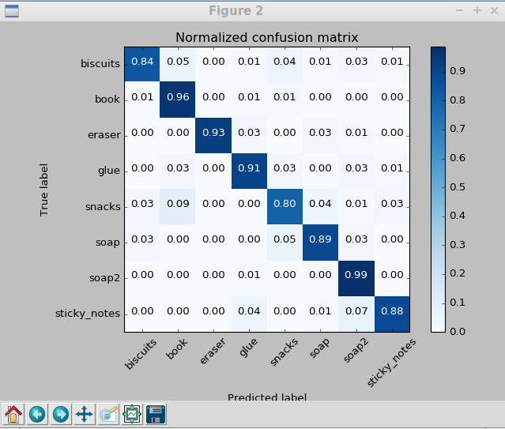
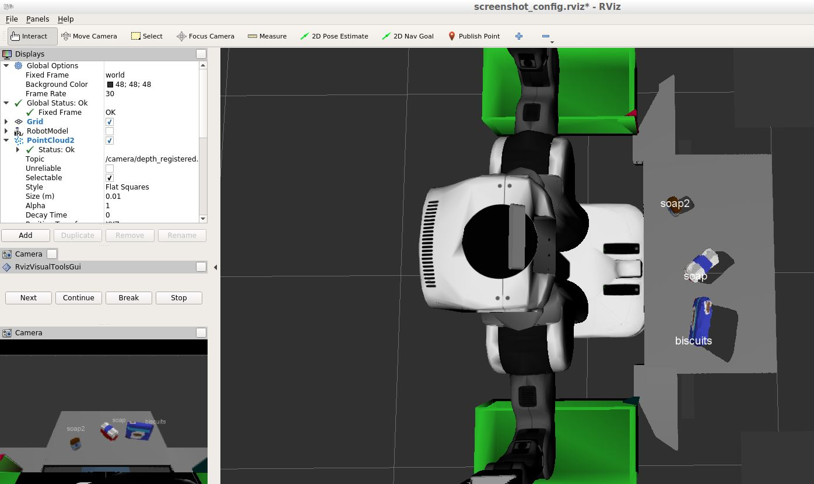
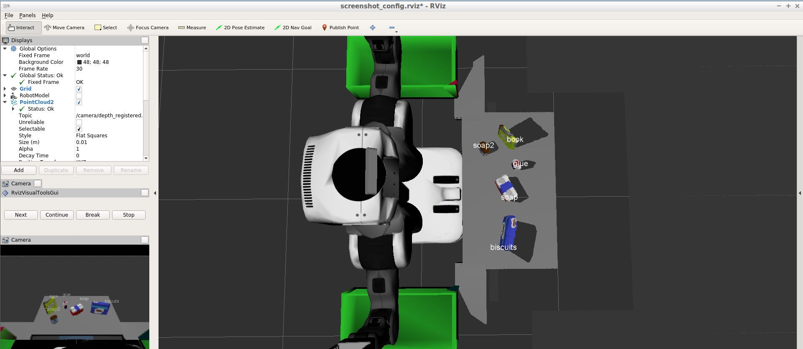
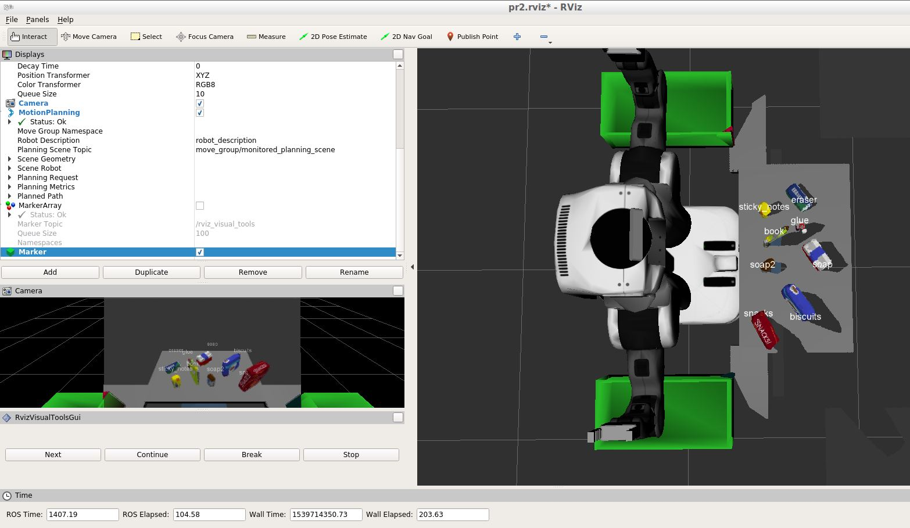

# Project: Perception Pick & Place

### Project Submission for Robotics Nanodegree Programme (Udacity)

This project aims to detect & classify objects in a simulated tabletop setting followed by a pick-and-place operation of each object by controlling a PR2 robot.

The PR2 has been outfitted with an RGB-D sensor. This sensor however is a bit noisy, much like real sensors. 

The point cloud data from this sensor is first filtered and then the the points are clustered into individual objects. These objects are then classified using ML. Finally, these objects are then picked up in an order defined by a specified “Pick-List”, and then placed in corresponding dropboxes.

**This project makes use of the following :**
 - Robot Operating System (ROS)
 - RViz
 - Gazebo
 - Statistical Outlier Filter
 - Voxel Grid Downsampling
 - Pass-through Filter
 - RANSAC Plane Segmentation
 - DBSCAN / Euclidean Clustering
 - Point Cloud Library
 - Supper Vector Machines for Classification


## Walkthrough of the Pipelines

### 1. Pipeline for Point Cloud filtering and RANSAC plane fitting

This pipeline has been implemented in:

**File** : [pick_place_project.py](./code/pick_place_project.py)

**Method** : pcl_callback(pcl_msg)

**Steps**

- The ROS message was first converted to PCL data. Doing this helps to apply various particle cloud filters as mentioned below.

- **Filter #1 : Statistical Outlier Filter** : Since the RGBD camera output is noisy, this filter helps to remove some noise from the particle cloud. The "mean_k" parameter was set to 3 (i.e. 3 neighbouring points used for detecting outliers) and the threshold scale factor was set to 0.1. Any point with a mean distance larger than global (mean distance+x*std_dev) will be considered outlier by this filter and be removed.

- **Filter #2 : Voxel Grid Downsampling** : This filter reduces the number of points in the point cloud. This in turn helps to reduce the processing power and memory footprint required for further analysis. The parameter LEAF_SIZE was set to 0.01 as it had the best balance between speed and accuracy.

- **Filter #3 : Pass through filter** The pass through filter helps to filter out regions by only keeping points within a range of the given Axis. Two different pass through filters were applied : one for the Z-Axis and another one for the Y-Axis. The Z-Axis filter has a threshold of (0.6 to 1.1) and is used to exclude the parts of the scene away from the objects of interest. The Y-Axis filter has a threshold of (-0.5 to +0.5) and is used to remove the drop boxes from the point cloud.

- **Filter #4 : RANSAC Plane Segmentation** : This filter finds all the points within a point cloud that support a plane model. This helped to filter out the table from the objects as the table conforms to the model of a plane. A model type of 'SACMODEL_PLANE' and method type 'SAC_RANSAC' having max_distance '0.01' worked well as parameters for this filter. 

The thresholds for each filter were found by running the simulation in Gazebo and visualizing the point cloud in RViz.

### 2. DBSCAN Clustering Pipeline

This pipeline has been implemented in:

**File** : [pick_place_project.py](./code/pick_place_project.py)

**Method** : pcl_callback(pcl_msg)

With the help of DBSCAN, the point cloud was clustered into distinct clusters, each corresponding to the object that was to be picked by the PR2 robot arm. The ability of DBSCAN to perform clustering without specifying the no. of clusters, proved to be very useful.

The following parameters were used for this filter:
 - Cluster tolerance = 0.02
 - Min Cluster Size = 50
 - Max Cluster Size = 10000

For visualization purposes, 

**Code snippet :**

```python=
    # Euclidean Clustering (DBSCAN)
    white_cloud = XYZRGB_to_XYZ(cloud_objects) # Apply function to convert XYZRGB to XYZ
    tree = white_cloud.make_kdtree()
    # Create a cluster extraction object
    ec = white_cloud.make_EuclideanClusterExtraction()
    # Set tolerances for distance threshold as well as minimum and maximum cluster size (in points)
    ec.set_ClusterTolerance(0.02)
    ec.set_MinClusterSize(50)
    ec.set_MaxClusterSize(10000)
    # Search the k-d tree for clusters
    ec.set_SearchMethod(tree)
    # Extract indices for each of the discovered clusters
    cluster_indices = ec.Extract()

    # Create Cluster-Mask Point Cloud to visualize each cluster separately
    # Assign a color corresponding to each segmented object in scene
    cluster_color = get_color_list(len(cluster_indices))
    print("No. of clusters:", len(cluster_indices))

    color_cluster_point_list = []

    for j, indices in enumerate(cluster_indices):
        for i, indice in enumerate(indices):
            color_cluster_point_list.append([white_cloud[indice][0],
                                            white_cloud[indice][1],
                                            white_cloud[indice][2],
                                             rgb_to_float(cluster_color[j])])

    # Create new cloud containing all clusters, each with unique color
    cluster_cloud = pcl.PointCloud_PointXYZRGB()
    cluster_cloud.from_list(color_cluster_point_list)
```

### 3. Pipeline for feature extraction and training

The pipeline has been implemented in the following files:

**Feature capturing**: 
- [capture_features.py](./code/capture_features.py)

**Feature extraction**:
- [features.py](./code/features.py)

**SVM Training**:
- [train_svm.py](./code/train_svm.py)

**Features used for SVM:** 
 - Color histograms (bin range 0 to 256)
 - Normal histograms (bin range -1 to +1)

The bin size for both of these histograms was set to 32. Having too small or too large of a bin size affected the accuracy when testing it in the actual environments.

The **SVM kernel** that was found to give the best result is: **RBF Kernel**

To train this SVM, 75 instances of each object (in a random orientation) was spawned in Gazebo and the features were computed and fitted to the SVM classifier.

It was found that the accuracy of the detected model could be improved greatly by increasing the number of instances spawned (i.e. the training sample). A count of 75 instances (= 75 * 8 = 600 samples) resulted in a total training time of around 30 mins.

The normalized confusion matrix after training is the following:



### 4. Object recognition/classification using SVM

The object classification pipeline is present in:

**File**: [pick_place_project.py](./code/pick_place_project.py) 
**Method**: pcl_callback(pcl_msg)

The previously trained SVM classifier model that was dumped using pickle is loaded in this pipeline and is then used to recognize the objects.

For feature extraction, the color and normal histograms are computed and fed to the saved SVM model for classification of the objects.

The names of the object predicted are published to a dedicated ROS topic : '/detected_objects'. This makes it easier to debug and visualize the predictions in RViz.

**Code snippet:**

```python=
    # Object classification

    detected_objects_labels = []
    detected_objects = []

    # Loop through each detected cluster one at a time

    for index, pts_list in enumerate(cluster_indices):

        # Grab the points for the cluster from the extracted outliers (cloud_objects)
        pcl_cluster = cloud_objects.extract(pts_list)

        # Convert the cluster from pcl to ROS using helper function
        ros_cluster = pcl_to_ros(pcl_cluster)

        # Extract histogram features
        # Complete this step just as is covered in capture_features.py
        chists = compute_color_histograms(ros_cluster, using_hsv=True)
        normals = get_normals(ros_cluster)
        nhists = compute_normal_histograms(normals)
        feature = np.concatenate((chists, nhists))

        # Make the prediction, retrieve the label for the result
        # and add it to detected_objects_labels list
        prediction = clf.predict(scaler.transform(feature.reshape(1,-1)))
        label = encoder.inverse_transform(prediction)[0]
        detected_objects_labels.append(label)

        # Publish a label into RViz
        label_pos = list(white_cloud[pts_list[0]])
        label_pos[2] += .2
        object_markers_pub.publish(make_label(label,label_pos, index))

        # Add the detected object to the list of detected objects.
        do = DetectedObject()
        do.label = label
        do.cloud = ros_cluster
        detected_objects.append(do)

    rospy.loginfo('Detected {} objects: {}'.format(len(detected_objects_labels), detected_objects_labels))
```

### 5. Pick and Place by controlling arms of PR2 Robot

The PR2 robot arm pick and place pipeline is coded in:

**File**: [pick_place_project.py](./code/pick_place_project.py) 
**Method**: pr2_mover(detected_objects)

The list of all objects to be picked up is obtained from the ROS parameter server having key as '/object_list'.

Similarly, the details of the name and location of each dropbox is obtained from the ROS parameter '/dropbox'.

For each detected object, the centroid of the object is computed. This information is used to create the 'Pick' and 'Pose' ROS messages. These messages are then sent over to the ROS service 'pick_place_routine' to move the PR2 robot arms.

For debugging purposes, and also to satisfy the Udacity project requirements, these Pick and Pose messages were dumped into output YAML files.

#### Results of object recognition and pick-place requests

The code was simulated in 3 different test scenarios / environments. It achieved 100% success rate in each such environment.

The following are the screenshots that show label markers in RViz that demonstrates object recognition success rate in each of the three scenarios:

**Environment #1**:



**Environment #2**:



**Environment #3**:



### Conclusion

RANSAC, DBSCAN and SVM all proved to be very useful in filtering, clustering and recognition of the objects. Capturing and training a large number of samples in different orientations helped a lot with the accuracy from the SVM classifier.

As a future enhancement, collision avoidance can be added to the pipeline, i.e. the PR2 robot can be made aware of collidable objects like the table and objects on top of it. This can be implemented by publishing a point cloud which the motion planning pipeline can subscribe to and use that for a 3D collision map.
